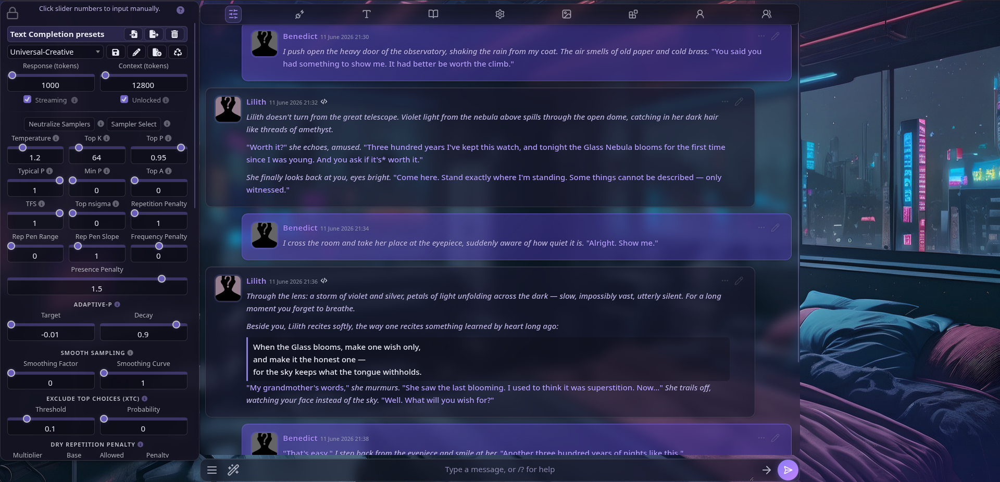
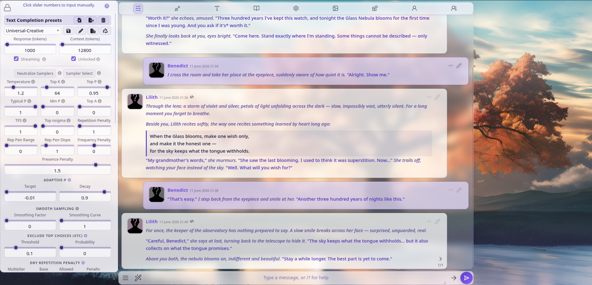
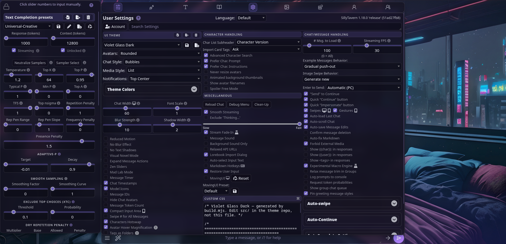
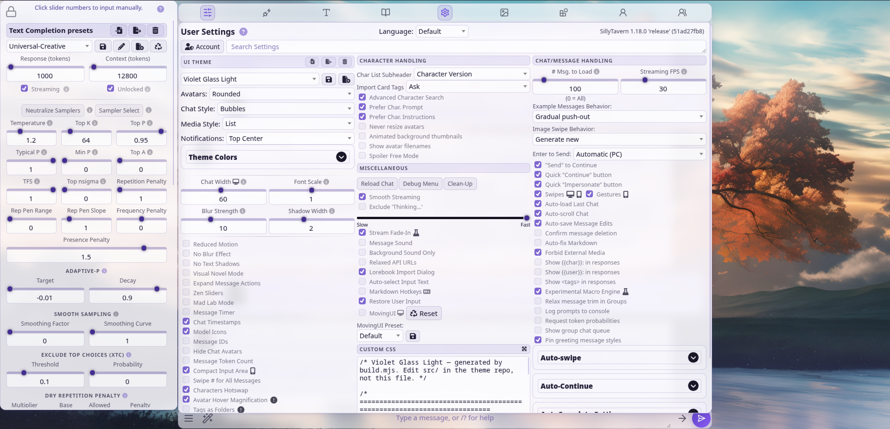

# Violet Glass

<p align="center">
  
  
  
  
</p>

A modern glassmorphism theme pair for [SillyTavern](https://github.com/SillyTavern/SillyTavern) — frosted translucent panels, hairline borders, soft layered shadows, rounded message cards, and a violet/indigo accent. Ships as two standalone UI themes:

- **Violet Glass Dark** (primary)
- **Violet Glass Light**

## Features

- **Ambient backdrop**: the theme paints its own layered gradient field (plus a faint grain) over the background layer, so the glass has something to glow against even before you pick a background image — and acts as a violet color grade once you do.
- **Refined glass**: frosted message cards with an asymmetric user/bot rhythm, drawers, popups and menus with 1px hairlines, inner top highlights and layered (violet-tinted, in Light) shadows.
- **One designed system, not a reskin**: accent checkboxes and slider thumbs, gradient send button, carded settings sections, styled character names, calmed top bar.
- **Modern icons**: the ~20 highest-visibility icons (top bar, send area, message actions, swipes) are replaced with [Lucide](https://lucide.dev) outline icons embedded as data-URI masks (ISC license). Every replacement is guarded by the element's original Font Awesome class, so an upstream change makes an icon fall back to stock instead of disappearing.
- **Calm chrome**: secondary controls (message action rows, settings sliders and checkboxes) rest at reduced opacity and sharpen on hover/focus — nothing moves or hides, the UI just gets quieter.
- **Expressive but accessible motion**: message entrance, soft popup fade-scale, springy send-button and drawer-icon hovers — transform/opacity only, and **all of it stops** when SillyTavern's *Reduced Motion* setting or your OS `prefers-reduced-motion` preference is on.
- **Theme-editor friendly**: every major surface keeps its color on SillyTavern's built-in color pickers (`SmartTheme` variables). Recolor the whole theme from User Settings without touching CSS.
- **Respects your settings**: the theme JSONs only ship visual-identity keys. Preferences like timers, timestamps, compact input, click-to-edit, toast position etc. are *not* included, so applying the theme never overwrites them. (`fast_ui_mode` and `noShadows` are explicitly set to `false` — the glass look needs blur and shadows.)
- **No web fonts, no `@import`, no remote anything.** Uses a rounded system font stack; install [Inter](https://rsms.me/inter/) locally if you want an even nicer fit.
- Degrades gracefully in flat/document chat styles and in *Fast UI* (blurless) mode.

## Install

**Option A — UI import:** User Settings → UI Theme → import button → pick a JSON from [`dist/`](dist/).

**Option B — file copy:** copy both files from `dist/` into your SillyTavern data folder:

```
SillyTavern/data/<your-user>/themes/
```

then reload the UI and select the theme under User Settings → UI Theme.

**Set a background image** (Backgrounds menu) — glassmorphism is the art of blurring what's behind the glass, and the theme is designed around it. Soft, slightly busy art works best: dark/moody for **Dark**, pale/airy for **Light**. The built-in ambient backdrop keeps things presentable with no image set, but a good background is half the look.

## Development

Source of truth is `src/` — **never hand-edit `dist/`** (SillyTavern's theme editor also rewrites installed JSONs; treat those as disposable).

```
src/
├── base.css         # shared surface styles, colors only via tokens
├── vars-dark.css    # dark color tokens (--vg-*)
├── vars-light.css   # light color tokens
├── theme-dark.json  # theme template (non-CSS properties)
└── theme-light.json
```

Build (no dependencies, Node 18+):

```bash
node build.mjs                  # writes dist/
node build.mjs --install [path] # ...and copies into a ST themes folder
                                # (default: ../SillyTavern/data/default-user/themes)
node build.mjs --watch --install  # rebuild + reinstall on every src/ change
```

The build concatenates a banner, the variant's token block and `base.css` into each theme's `custom_css`, and refuses to emit anything containing `@import` (SillyTavern blocks it at import time).

Tested with SillyTavern **1.18.0**. Selectors in `base.css` are grouped per surface with comments, so if an upstream release moves something, the breakage is local and easy to patch.

## License

[MIT](LICENSE)
